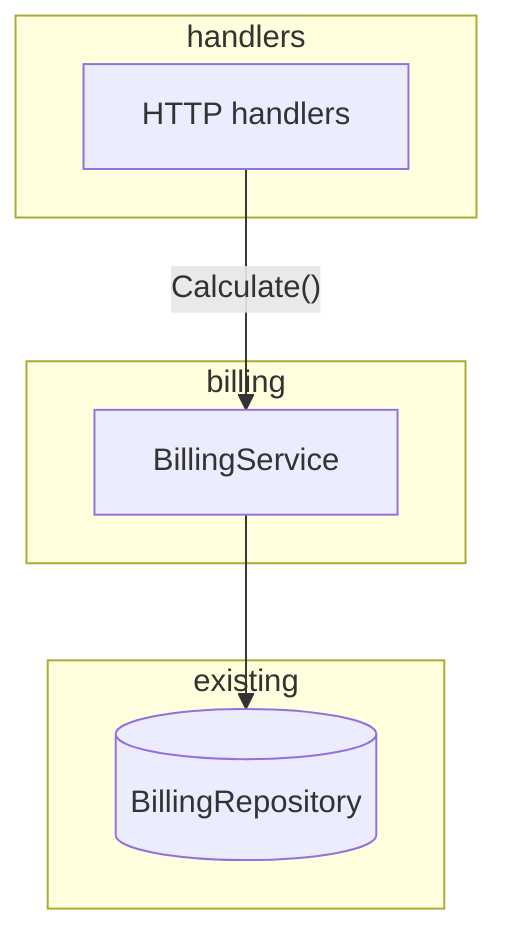

# Plan Examples

## Good plan file (extract service behind a boundary)

Path: `docs/plans/billing-service-extract/plan.md` + `scratch.md` (default layout)

```markdown
# Plan: billing-service-extract

**Approved:** 2026-06-12

## Status

- [ ] PR 1: Extract calculation into BillingService; handlers delegate
- [ ] PR 2: Add unit tests for edge cases
- [ ] PR 3: Delete duplicated inline helpers in handlers

## Goal

Move billing calculation out of HTTP handlers into a testable domain module.

## Architectural decisions

1. Boundary placement — chose in-process `internal/billing/` module over a standalone service. Same process keeps ops cost flat; the seam is the value, not the network hop.
2. Migration shape — chose extract-then-test over rewrite-with-tests. Behavior-unchanged first slice is easiest to review.

## Design decisions

1. Calculation surface — chose a single `BillingService.Calculate` method over per-handler helpers. Generalizes the two inline calculation copies in `internal/handlers/`.

## Approach

Add `BillingService` with the existing calculation logic unchanged; handlers call one method and map errors at the seam.

## Boundaries

- `internal/billing/` — pure calculation, no HTTP or DB types
- `internal/handlers/` — request/response translation only
- Existing `BillingRepository` interface stays; handlers do not import SQL types

## Contracts

```
HTTP handler → BillingService.Calculate
  input:  { lineItems, taxRegion, repoId }
  output: { total, breakdown } | error
  invariant: same numeric results as inline calculation today; errors mapped to HTTP at handler
```

## Investigation

- `internal/handlers/billing.go`, `internal/handlers/invoice.go` — duplicate inline calculation (two call sites)
- `internal/billing/` — new package; match error wrapping style from `internal/handlers/errors.go`

## Diagram



Handlers delegate to `BillingService.Calculate()` at the seam; repository unchanged.

## Increments

### PR 1: Extract calculation into BillingService; handlers delegate

- **Story:** Reviewers see behavior-preserving extraction—same inputs/outputs, new seam.
- **Edits:** introduce, wire
- **Depends on:** none
- **Acceptance:**
  - [ ] `BillingService.Calculate` exists with logic moved unchanged
  - [ ] Both handlers delegate; integration tests pass
- **Touch set:** `internal/billing/service.go` → introduce; `internal/handlers/*.go` → wire

### PR 2: Add unit tests for edge cases

- **Story:** Reviewers verify edge cases without HTTP noise.
- **Edits:** tests-only
- **Depends on:** PR 1 merged — `BillingService` exists
- **Acceptance:**
  - [ ] Edge cases from investigation covered in `service_test.go`
- **Touch set:** `internal/billing/service_test.go` → introduce

### PR 3: Delete duplicated inline calculation helpers in handlers

- **Story:** Reviewers confirm dead inline logic is gone after PR 1 delegation.
- **Edits:** remove-shim, mechanical
- **Depends on:** PR 1 merged — handlers already delegate
- **Acceptance:**
  - [ ] No duplicate calculation helpers remain in handlers
- **Touch set:** `internal/handlers/*.go` → remove-shim (duplicate helpers only)

## Tradeoffs & risks

- PR 1 is a large diff but zero behavior change—merges alone; easier review than mixed refactor + behavior
- Two call sites still duplicate input mapping until PR 3; acceptable per tenet 3

## Open questions

- Should failed calculations return 422 or 500? (**defer** — inconsistent today, out of scope)

## Plan drift

none
```

**Why it's good:** Contracts + Investigation let a cold session start without re-exploring. Each increment has **Depends on** and **Acceptance**. Default `plan.md` + `scratch.md` pair supports resumption.

---

## Plan vs Gate D (two approvals)

**Plan (after B+C):** decisions, approach, boundaries, diagram—_what_ and _what shape_.

```markdown
## Boundaries
- `internal/billing/` — pure calculation, no HTTP types
- `internal/handlers/` — request/response translation only

## Diagram
[mermaid: layers and flow — no PR 1 / PR 2 labels]

Approve this plan? Ready to sequence increments?
```

**Gate D (after Plan):** increments only—_how_ it ships.

```markdown
### PR 1: Extract BillingService; handlers delegate
- **Story:** ...
- **Edits:** introduce, wire
```

---

## Good plan (rename with bridge PR)

When a type rename and behavior change would interleave in the same files, peel rename (+ bridge) from behavior—same pattern as split-commit.

```markdown
### PR 1: Introduce `Stage` enum; keep `TStage` alias

- **Story:** Reviewers see the new name land with zero caller churn.
- **Edits:** introduce, mechanical
- **Bridge:** `export type TStage = Stage` until PR 2 removes it
- **Touch set:** `pkg/stage/types.ts` → bridge; consumer files → unchanged until PR 2

### PR 2: Rename consumers and remove `TStage` alias

- **Story:** Reviewers see mechanical rename + alias removal only—no logic changes.
- **Edits:** mechanical, remove-shim
- **Touch set:** `pkg/stage/types.ts` → remove-shim; `pkg/**/*.ts` (consumers) → mechanical-only

### PR 3: Change staging validation behavior

- **Story:** Reviewers focus on semantics now that names are stable.
- **Edits:** behavior
- **Touch set:** `pkg/stage/validate.ts` → behavior (whole file—rename + logic were interleaved here)
```

**Why it's good:** Diff hygiene separates mechanical rename from behavior; bridge keeps the stack mergeable; interleaved file assigned to dominant PR 3.

---

## Bad plan (vague refactor)

```markdown
## Goal
Clean up auth.

## Approach
Refactor auth to be cleaner and more modular.

## Increments
1. Refactor auth code
2. Add tests
3. Clean up leftovers
```

**Why it's bad:** No boundaries, no diagram at Plan, no **story** or **edits** per PR, increments aren't shippable slices, "cleaner" isn't an approach, PR 3 is orphan tail work.

---

## Good Gate B/C decision tiers

Most decisions are Assumed (no label). **Soft fork** when alternatives exist but one path is clearly better. **Hard fork** only when progress must block.

```markdown
### 1. API boundary
- **Options:** existing cereal routes vs new Origin-only routes
- **Recommend:** existing routes — UI already wired (Assumed: framing said "wire into current UI")

### 2. Cache layer — **Soft fork**
- **Options:** in-process LRU vs Redis
- **Recommend:** in-process — framing said "no new infra"; easy to extract later if needed

### 3. Version scoping — **Hard fork**
- **Options:** pass `headCommitSha` from client vs server always uses latest
- **Recommend:** `headCommitSha` — matches "currently displayed version" if product intent is per-version
- **Need your call:** version-scoped vs PR-wide changes product semantics

No hard forks besides item 3; remaining items Assumed from framing or conventions.
```

**Don't:** Hard fork when framing or convention already settled it. Don't repeat tier labels after the user answers.

---

## Batched B + C

When neither gate has hard forks—one message, B then C, then **Plan** (with diagram), single objection window before Plan (see SKILL **Confirm (B and C)**).

---

## Bad tier usage

```markdown
### 1. HTTP client — **Hard fork**
- **Options:** `fetch` vs `axios`
- **Recommend:** `fetch` — repo already uses it everywhere
```

**Why it's bad:** Dominant repo convention makes this Assumed, not Hard fork. Over-marking hard forks recreates the old "confirm everything" friction.
