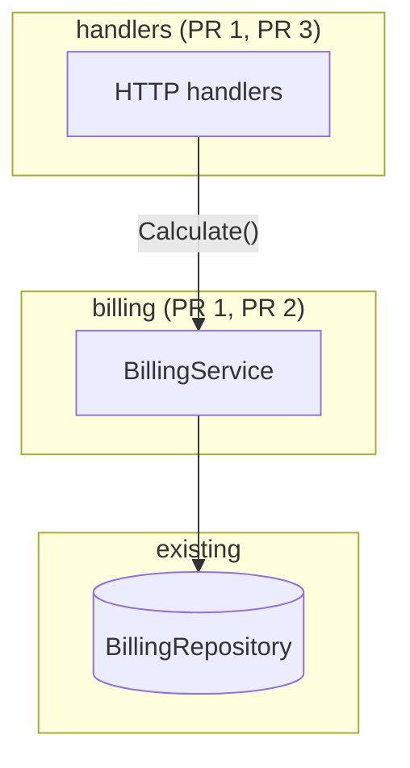

# Plan Examples

## Good plan file (extract service behind a boundary)

Path: `docs/plans/billing-service-extract.md` (example—user chooses where to persist)

```markdown
# Plan: billing-service-extract

**Approved:** 2026-06-12

## Status

- [ ] PR 1: Extract calculation into BillingService; handlers delegate
- [ ] PR 2: Add unit tests for edge cases
- [ ] PR 3: Delete duplicated inline helpers in handlers

## Goal

Move billing calculation out of HTTP handlers into a testable domain module.

## Architectural decisions

1. Boundary placement — chose in-process `internal/billing/` module over a standalone service. Same process keeps ops cost flat; the seam is the value, not the network hop.
2. Migration shape — chose extract-then-test over rewrite-with-tests. Behavior-unchanged first slice is easiest to review.

## Design decisions

1. Calculation surface — chose a single `BillingService.Calculate` method over per-handler helpers. Generalizes the two inline calculation copies in `internal/handlers/`.

## Approach

Add `BillingService` with the existing calculation logic unchanged; handlers call one method and map errors at the seam.

## Boundaries

- `internal/billing/` — pure calculation, no HTTP or DB types
- `internal/handlers/` — request/response translation only
- Existing `BillingRepository` interface stays; handlers do not import SQL types

## Diagram



Handlers thin-delegate in PR 1; tests land in PR 2; duplicate helpers removed in PR 3.

## Increments

1. **PR 1:** Extract calculation into `BillingService`; handlers delegate (behavior unchanged)
2. **PR 2:** Add unit tests for edge cases currently only covered by integration tests
3. **PR 3:** Delete duplicated inline calculation helpers in handlers

## Tradeoffs & risks

- PR 1 leads (refactor before feature) and is a large diff but zero behavior change—merges with no behavior risk, easier review than a mixed refactor + behavior PR
- Two call sites still duplicate input mapping until PR 3; acceptable per tenet 3

## Open questions

- Should failed calculations return 422 or 500? (currently inconsistent)

## Plan drift

none
```

**Why it's good:** One path, clear boundaries, diagram shows layers and PR scope, one increment per PR, open questions surfaced. The design decision names the abstraction up front, and the PR stack runs bottom-up with the behavior-preserving extraction first—so PR 1 can merge alone before any new behavior lands.

---

## Bad plan (vague refactor)

```markdown
## Goal
Clean up auth.

## Approach
Refactor auth to be cleaner and more modular.

## Increments
1. Refactor auth code
2. Add tests
3. Clean up leftovers
```

**Why it's bad:** No boundaries, no diagram, increments aren't shippable PRs, "cleaner" isn't an approach. Would fail the gate—rewrite before asking for approval.

---

## Good Gate B/C fork usage

**Do:** Recommend on most lines; mark only open decisions.

```markdown
### 1. API boundary
- **Options:** existing cereal routes vs new Origin-only routes
- **Recommend:** existing routes — UI already wired

### 2. Version scoping — **Fork**
- **Options:** pass `headCommitSha` from client vs server always uses latest
- **Recommend:** `headCommitSha` — matches "currently displayed version"
- **Need your call:** confirm version-scoped vs PR-wide before design

No other forks; items 1 and 3–7 follow from framing.
```

**Don't:** Repeat `Fork? No` on every numbered decision after the user already locked scope.
