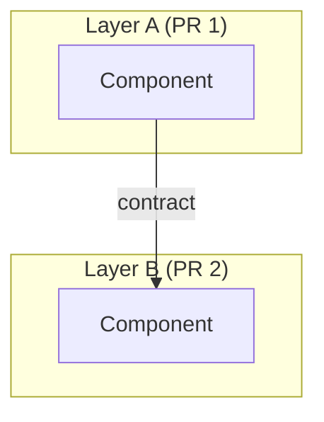

# Plan: [short-slug]

**Approved:** [date, set when user approves]

## Status

- [ ] PR 1: [short label matching increment 1 below]
- [ ] PR 2: [short label]
- [ ] PR 3: [short label]

## Goal

[One sentence]

## Architectural decisions

1. [Decision] — chose [option]. [One-line why.]
2. ...

## Design decisions

1. [Decision] — chose [option]. [One-line why.] [Touches: existing code reshaped/extracted, if any]
2. ...

## Approach

[The one obvious path, given the decisions above]

## Boundaries

[Modules/layers touched; stable contracts; seam translations—no file paths]

## Diagram

[One-sentence caption if the diagram needs context]

## Increments

One increment = one PR, bottom-up merge order. Pure refactors lead so they merge with zero behavior risk.

1. **PR 1:** [Smallest shippable slice]
2. **PR 2:** [...]
3. **PR 3:** [...]

## Tradeoffs & risks

- [...]

## Open questions

- [...]

## Plan drift

[Notes from execute-increment checkpoints—or "none"]
