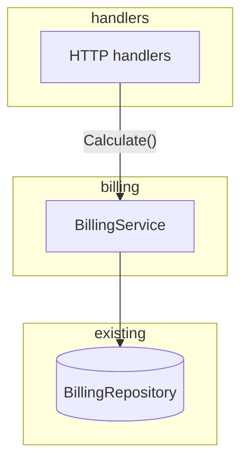

# Plan: [short-slug]

**Approved:** [date, set at Plan approval]

## Status

- [ ] PR 1: [short label matching increment 1 below]
- [ ] PR 2: [short label]
- [ ] PR 3: [short label]

## Goal

[One sentence — framing]

## Architectural decisions

[Gate B — settled choices only, no tier labels]

1. [Decision] — chose [option]. [One-line why.]
2. ...

## Design decisions

[Gate C]

1. [Decision] — chose [option]. [One-line why.] [Touches: reshaped/extracted code, if any]
2. ...

## Approach

[One obvious path]

## Boundaries

[Modules/layers; contracts at seams]

## Contracts

[Plan approval — new or changed boundaries only; pseudocode OK]

```
Caller → Callee
  input:  { ... }
  output: { ... }
  invariant: [ordering, errors, idempotency, …]
```

## Investigation

[Anchor files, patterns to follow, gotchas from B/C exploration—not decisions]

- `path/to/file` — [why it matters]
- Pattern: [e.g. match existing X in Y]

## Diagram

[Plan approval — boundaries and flow only; no PR labels]



[Caption if needed]

## Increments

[Gate D — after Plan approval]

One increment = one PR, bottom-up (build order + diff hygiene). Repeat per PR.

### PR 1: [title]

- **Story:** [what the reviewer verifies first]
- **Edits:** [e.g. introduce, mechanical]
- **Depends on:** [none, or "PR N merged — reason"]
- **Acceptance:**
  - [ ] [observable done criterion]
- **Bridge:** [optional]
- **Touch set:** [required when touching existing code — `path` → role]

## Tradeoffs & risks

[Plan-level from P; append increment sequencing tradeoffs from D]

## Open questions

[From Plan approval — tag **blocking** or **defer**]

## Plan drift

[Only when the approved plan changes—or "none"]
